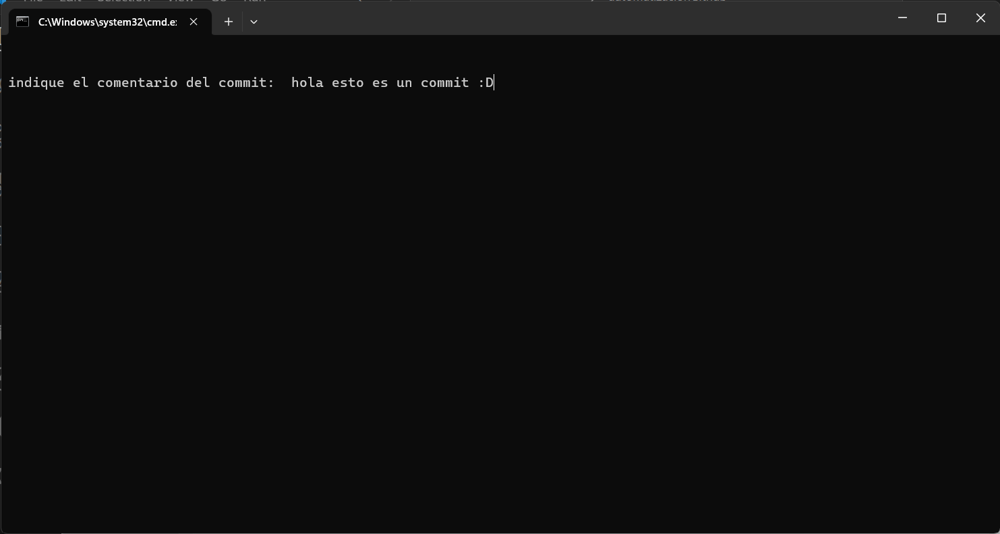

# Automatización de GitHub

###### - Por ➡️ Natalia cortes -

Este es un pequeño programa que automatiza la subida a GitHub mediante un pequeño menú donde pregunta al usuario 

> primeramente la ruta absoluta del proyecto en el equipo esto lo puedes conseguir buscando la carpeta y copiando en la clipboard la ruta donde se encuentra la carpeta donde se aloja el repositorio

> ⚠️ Es necesario tener  una cuenta de github y la url del repositorio en GitHub, además de tener conocimientos previos de git y github (al menos para saber que es un push). ⚠️

> Y finalmente la acción que quiere realizar:
>  
>        -1 ➡️ push (Sube el repositorio a GitHub)
>        -2 ➡️ merge (Fusiona ramas)
>        -3 ➡️ stash (Guarda todos los cambios en un buffer)        
>        -4 ➡️ salir (Sale del programa)

## Ejemplos de uso: 

> Aportación de la ruta absoluta de la carpeta deseada para realizar la acción requerida.

> Escritura del commit para insertar en el pusheo.

> Por último se muestra el menú del programa con el cual se indica la tarea a realizar